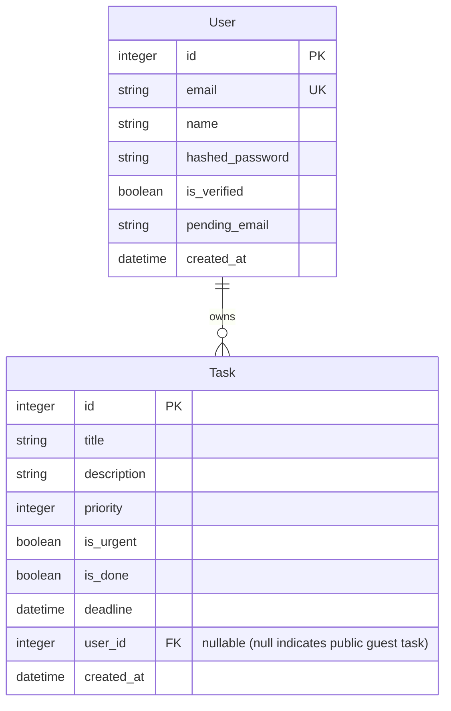

# Task Manager (Full-Stack TODO Application)

A modern, production-grade full-stack task management application designed for both public guest interaction and private verified users. Guests can view and play with shared public tasks, while registered users unlock a private, secure dashboard workspace.

## 🔗 Live Deployments

- **Frontend (Vercel):** [App Link](https://notebook-python-fast-api.vercel.app)
- **Backend (Render):** [API Link](https://notebook-python-fastapi.onrender.com)
- **Backend Docs:** [Documentation](https://notebook-python-fastapi.onrender.com/docs)

---

## 🌟 Key Features

- **Dual-Mode Workspace:**
  - **Public Guest Mode:** Visitors can search, filter, sort, create, and mark public tasks as completed to demo the site interface.
  - **Private User Space:** Registering and verifying an account locks down a dedicated, private task dashboard.
- **Email Verification:** Signups automatically trigger a secure confirmation email containing a verification link powered by the **Brevo API**.
- **Rich Task Attributes:** Keep track of task statuses, priority ratings (1 to 10), deadlines with a calendar picker, and custom markdown/rich-text description fields.
- **Dynamic Sorting & Filtering:** Instantly search through tasks or filter by Status (Done, Undone, Urgent) and Sort by priorities or creation dates.
- **Premium Dark Mode Toggle:** A fully customized theme provider built on vanilla CSS variables that switches seamlessly between beautiful Light and Dark themes.

## 💡 Architecture & Engineering Decisions (For Recruiters)

This project is built using professional, scalable backend and frontend software engineering practices. Key highlights include:

### 1. Security-First Authentication

- **HttpOnly Cookies:** To protect against Cross-Site Scripting (XSS) attacks, JWT authentication tokens are stored in secure `HttpOnly`, `SameSite=Lax` cookies rather than local storage.
- **Cryptographic Hashing:** User passwords are encrypted on the server using `bcrypt` (via `passlib`) before database insertion.
- **CORS Origin Sanitization:** Backend handles strict CORS origin checks, automatically parsing and sanitizing trailing slashes from environment origins to guarantee robust cloud communication.

### 2. Email Validation & State Management

- **Brevo API Integration:** Built a transactional mail service utilizing the **Brevo API** to dispatch verification codes. The application blocks access to private dashboard resources until the user's `is_verified` status is confirmed.
- **Cascade State Handling:** Implemented clean state-refresh triggers in React to ensure the UI updates instantly after login/email verification.

### 3. High-Performance Styling & Theme Engine

- **Vanilla CSS Variables:** Avoided bloated framework packages (like Tailwind CSS) in favor of lightweight **CSS Modules** and **CSS Custom Properties**. This achieves instantaneous theme toggle execution (Light/Dark mode) with zero runtime performance hits.
- **Framer Motion Layouts:** Modals, zoom overlays, and list updates use hardware-accelerated grid transitions for a premium, native-like user experience.

### 4. Relational Database & Migration Strategy

- **Alembic Migration Tracking:** Database schemas are structured and modified using version-controlled **Alembic** migration history, rather than development-only auto-creation.
- **Nullable Foreign Key Mapping:** Public tasks are separated from private tasks using a nullable `user_id` foreign key. This allows guest visitors to play with the interface safely, while keeping registered user workspaces fully isolated and secure.

### 5. Automated Regression & Integration Tests

- **SQLite Test Isolation:** Implemented an automated test suite utilizing an in-memory SQLite database, guaranteeing that test runs are extremely fast, fully isolated, and side-effect free.
- **Full API Lifecycle Verification:** Covers 29 distinct scenarios including token-based authentication guards (via HttpOnly cookies), guest workspace scoping, input validation (e.g. priority range 1-10, timezone-aware future deadlines), and state tracking.

---

## 🛠️ Tech Stack

### Frontend

- **Core:** Next.js (React), TypeScript
- **Styling:** Vanilla CSS & CSS Modules (custom variables)
- **Animations:** Framer Motion (for smooth grid transitions and modal fades)

### Backend

- **Framework:** FastAPI (Python)
- **Database:** PostgreSQL (with SQLAlchemy ORM)
- **Migrations:** Alembic
- **Mail Service:** Brevo Transactional Mail API
- **Auth:** JSON Web Tokens (JWT) & bcrypt hashing

---

## 📊 Database Schema



---

## 🚀 Local Setup & Installation

### Prerequisite Environment Configuration

#### 1. Backend Environment (`backend/.env`)

Create a `.env` file in the `backend/` directory:

```env
DATABASE_URL=postgresql://<user>:<password>@localhost:5432/<dbname>
FRONTEND_URL=http://localhost:3000
BACKEND_URL=http://localhost:8000
BREVO_API_KEY=your_brevo_api_key_here
BREVO_SENDER_EMAIL=your_sender_email_here
JWT_SECRET_KEY=your_secure_jwt_secret_key
```

#### 2. Frontend Environment (`frontend/.env.local`)

Create a `.env.local` file in the `frontend/` directory:

```env
NEXT_PUBLIC_API_URL=http://localhost:8000
```

### Installation Steps

#### Step 1: Run the Backend Server

1. Navigate to the backend directory:
   ```bash
   cd backend
   ```
2. Create and activate a Python virtual environment:
   ```bash
   python -m venv .venv
   source .venv/bin/activate  # On Windows: .venv\Scripts\activate
   ```
3. Install dependencies:
   ```bash
   pip install -r requirements.txt
   ```
4. Run migrations to initialize the local database:
   ```bash
   alembic upgrade head
   ```
5. _(Optional)_ Seed the database with the public interactive tutorial tasks:
   ```bash
   python seed_public_tasks.py
   ```
6. Start the FastAPI development server:
   ```bash
   uvicorn app.main:app --reload
   ```

#### Step 2: Run the Frontend Server

1. Navigate to the frontend directory:
   ```bash
   cd ../frontend
   ```
2. Install npm dependencies:
   ```bash
   npm install
   ```
3. Run the Next.js development server:
   ```bash
   npm run dev
   ```
4. Open [http://localhost:3000](http://localhost:3000) in your browser!

#### Step 3: Run the Backend Test Suite

To verify the API integrity, authentication guards, and database constraints, run the automated test suite:

1. Navigate to the backend directory:
   ```bash
   cd backend
   ```
2. Activate your virtual environment and run the test suite:
   ```bash
   source .venv/bin/activate
   pytest -v
   ```
